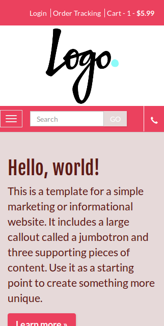
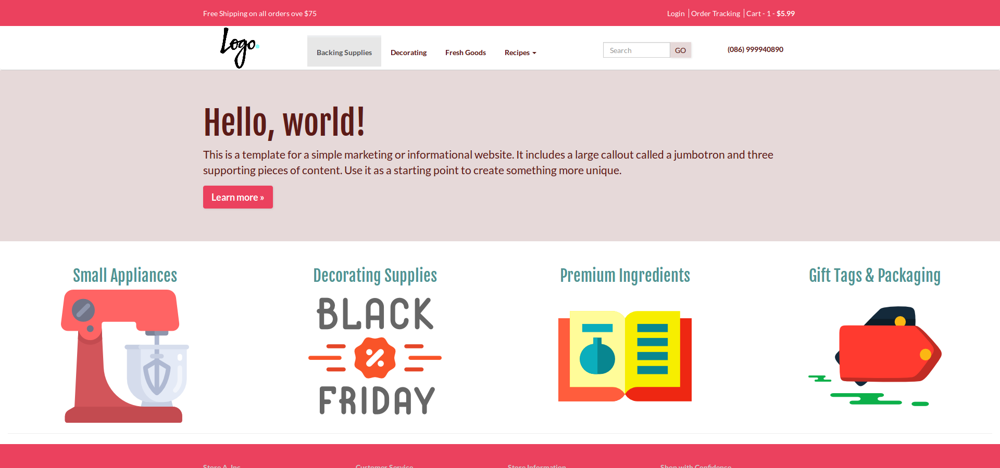

    Creating layout using concept mobile first
## Steps ##

 1.  Understand the business model, it is a store, thereby modeled what is most necessary to expose in small screen. Implemented
  
  
 
 2.  Modele what is most necessary to expose in big screen. Implemented
  
  

----------
